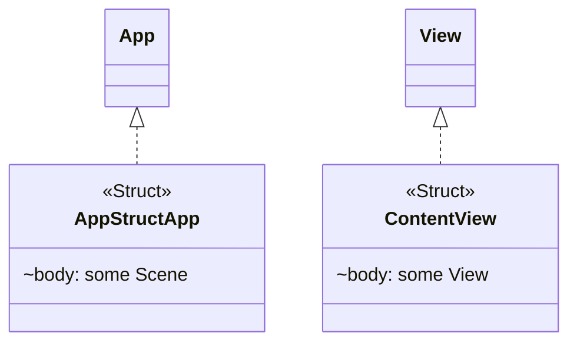

# StructDiagramKit

Swift Package tự động phân tích mã nguồn Swift và tạo sơ đồ cấu trúc (class diagram) theo định dạng Mermaid.js. Hỗ trợ tích hợp trực tiếp vào Xcode thông qua Command Plugin.

## Tính năng

- **Phân tích AST** — Sử dụng SwiftSyntax để trích xuất `class`, `struct`, `enum`, `protocol` cùng các thuộc tính, phương thức và mối quan hệ kế thừa/tuân thủ giao thức.
- **Tạo sơ đồ Mermaid.js** — Xuất cú pháp `classDiagram` chuẩn, hiển thị trực tiếp trên GitHub/GitLab.
- **Xcode Command Plugin** — Nhấp chuột phải trong Xcode để tạo sơ đồ, không cần chuyển sang Terminal.
- **Tự động cập nhật README** — Chèn hoặc thay thế sơ đồ trong `README.md` giữa các thẻ giữ chỗ (placeholder markers).
- **CLI linh hoạt** — Nhiều tùy chọn lọc theo access level, ẩn/hiện properties/methods, nhóm theo thư mục.

## Cấu trúc Package

```
StructDiagramKit/
├── Package.swift
├── Sources/
│   ├── CoreLibrary/          # Engine phân tích + tạo sơ đồ
│   │   ├── Models.swift
│   │   ├── SwiftEntityVisitor.swift
│   │   ├── SourceAnalyzer.swift
│   │   ├── MermaidGenerator.swift
│   │   └── ReadmeUpdater.swift
│   └── DiagramCLI/           # Công cụ dòng lệnh
│       └── DiagramCLI.swift
├── Plugins/
│   └── DiagramPlugin/        # Xcode Command Plugin
│       └── DiagramPlugin.swift
└── Tests/
    └── CoreLibraryTests/     # 21 unit tests
```

## Yêu cầu hệ thống

- macOS 13.0+
- Swift 5.9+ / Xcode 15+

## Cài đặt

### Cách 1: Thêm vào dự án Swift Package

Trong `Package.swift` của dự án bạn:

```swift
dependencies: [
    .package(path: "../StructDiagramKit"),
]
```

### Cách 2: Thêm vào dự án Xcode (.xcodeproj)

1. Mở dự án trong Xcode.
2. Vào **File → Add Package Dependencies...**
3. Chọn **Add Local...** và trỏ tới thư mục `StructDiagramKit/`.

## Hướng dẫn sử dụng

### 1. Sử dụng qua CLI (Dòng lệnh)

**Build CLI tool:**

```bash
cd StructDiagramKit
swift build
```

**Tạo sơ đồ và in ra terminal:**

```bash
swift run diagram-cli /đường/dẫn/tới/Sources
```

**Lưu sơ đồ vào file:**

```bash
swift run diagram-cli /đường/dẫn/tới/Sources --output diagram.md
```

**Tự động cập nhật README.md:**

```bash
swift run diagram-cli /đường/dẫn/tới/Sources --update-readme /đường/dẫn/tới/README.md
```

**Ví dụ đầy đủ với các tùy chọn:**

```bash
swift run diagram-cli ./Sources \
  --update-readme ./README.md \
  --project-name "MyApp" \
  --access-level public \
  --exclude Tests Pods \
  --hide-methods \
  --group-by-directory
```

### 2. Sử dụng qua Xcode Plugin

Sau khi thêm package vào dự án:

1. Trong Xcode, nhấp chuột phải vào **tên package hoặc target** trong Project Navigator.
2. Chọn **Generate Diagram** từ menu ngữ cảnh.
3. Xcode sẽ yêu cầu cấp quyền ghi file — nhấn **Allow**.
4. Sơ đồ sẽ được tự động chèn vào `README.md` tại thư mục gốc của dự án.

### 3. Sử dụng qua SPM Command

```bash
cd /đường/dẫn/tới/dự/án
swift package --allow-writing-to-package-directory generate-diagram
```

## Các tùy chọn CLI

| Tùy chọn | Mô tả |
|---|---|
| `--output <path>` | Ghi sơ đồ vào file thay vì in ra terminal |
| `--update-readme <path>` | Cập nhật file README.md với sơ đồ mới |
| `--project-name <name>` | Tên dự án (dùng khi tạo README mới) |
| `--access-level <level>` | Mức truy cập tối thiểu: `open`, `public`, `internal`, `fileprivate`, `private` (mặc định: `internal`) |
| `--exclude <dirs...>` | Các thư mục cần bỏ qua (mặc định: Tests, Pods, .build, DerivedData) |
| `--hide-properties` | Ẩn thuộc tính trong sơ đồ |
| `--hide-methods` | Ẩn phương thức trong sơ đồ |
| `--group-by-directory` | Nhóm các entity theo thư mục nguồn |
| `--dry-run` | Chỉ in ra terminal, không ghi file |

## Tự động cập nhật README

Để sử dụng tính năng tự động cập nhật, thêm hai thẻ giữ chỗ vào `README.md`:

```markdown
<!-- DIAGRAM-START -->
<!-- DIAGRAM-END -->
```

Khi chạy lệnh với `--update-readme`, nội dung giữa hai thẻ sẽ được thay thế bằng sơ đồ Mermaid mới. Nội dung bên ngoài hai thẻ được giữ nguyên.

Nếu `README.md` chưa tồn tại, công cụ sẽ tự tạo file mới với template cơ bản.

## Ví dụ đầu ra

Với dự án AppStruct hiện tại, CLI tạo ra:



## Ký hiệu trong sơ đồ

| Ký hiệu | Ý nghĩa |
|---|---|
| `<<Struct>>` | Kiểu giá trị (struct) |
| `<<Interface>>` | Giao thức (protocol) |
| `<<Enumeration>>` | Kiểu liệt kê (enum) |
| `+` | public / open |
| `~` | internal |
| `-` | private / fileprivate |
| `$` | static |
| `<\|--` | Kế thừa (Inheritance) |
| `<\|..` | Tuân thủ giao thức (Conformance) |
| `-->` | Liên kết thuộc tính (Association) |

## Chạy Tests

```bash
cd StructDiagramKit
swift test
```

21 test cases bao gồm:
- **SourceAnalyzerTests** (7 tests) — Phân tích struct, class, enum, protocol, kế thừa, tuân thủ giao thức, lọc access level.
- **MermaidGeneratorTests** (10 tests) — Tạo cú pháp Mermaid, annotations, relationships, access prefixes, static members.
- **ReadmeUpdaterTests** (4 tests) — Thay thế/thêm mới sơ đồ trong README, tạo file mới.
